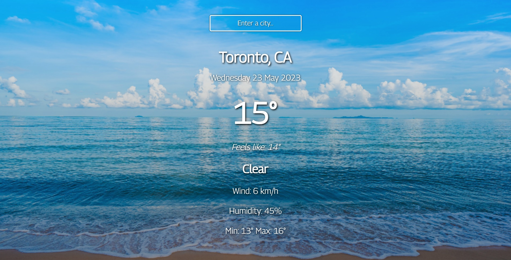

)

# Weather App

This is a fully-responsive Weather application. Get the weather in any place of the world in a real time.

<a href="https://weather-app-real-time.netlify.app/"><strong>➥ Live Demo</strong></a> 

## Description

The weather app works with the help of API from website [OpenWeather](https://openweathermap.org/).

You can **get the following info** upon request:

- city name, country name
- full date (in format: day-date-month-year)
- temperature (degrees celsius)
- feels like (temperature in degrees celsius)
- weather conditions (clear, clouds etc.)
- wind speed (km/h)
- humidity (%)

***The purpose of this project*** was to train my skills in working with **API** keys and reflect all received information in the application.

Moreover, I also practiced [AOS (Animated On Scroll Library)](https://michalsnik.github.io/aos/) **to animate data**.

### Built with

- HTML5
- CSS3
- Flexbox
- JavaScript
- [API](https://openweathermap.org/)
- [AOS](https://michalsnik.github.io/aos/)

### Screenshots

## How to use

Enter a city name in an input form, press the Enter tab and get your weather forecast.

As the app data is updated with the help of API requests you may need to wait for some time for the API answer. 

## License

This project is **free to use** and does not contain any license.
